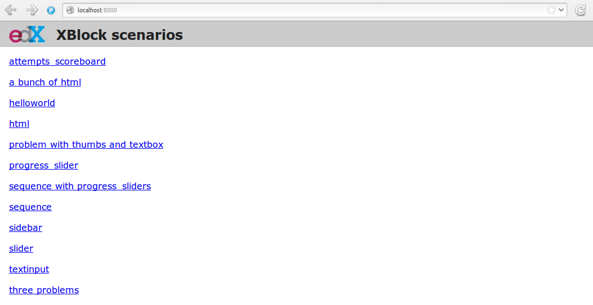
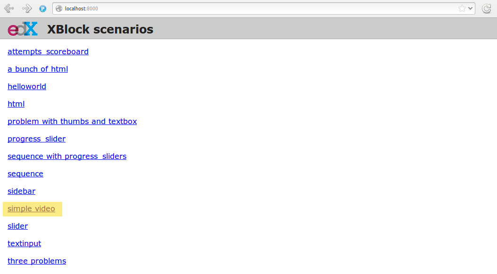
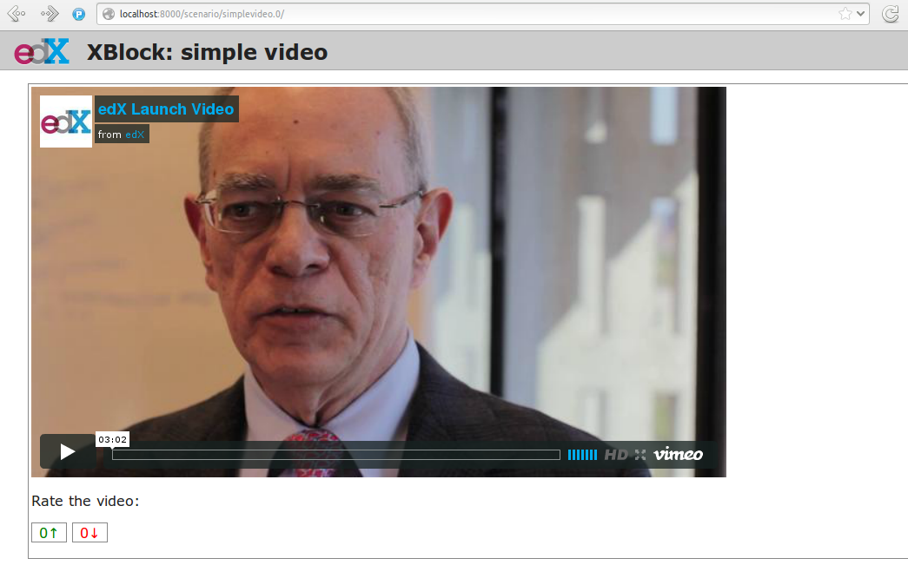

========
Tutorial
========

This tutorial will walk you through the creation of a custom XBlock. It will allow to display a
video in a course, using `oEmbed <http://oembed.com/>`_, and record when the student finishes
watching it.

To give you a sneak peek, the goal is to generate this:

Based on this: ::

    <vertical>
        <simplevideo href="https://vimeo.com/46100581" maxwidth="800" />
        
Rate the video:

        <thumbs />
    </vertical>

Setup
=====

Getting help
------------

If you get stuck, or have any question, and can't find the answer in this documentation, don't
hesitate to ask for help. You can either:

* Subscribe to the `edx-xblock@ mailing list <https://groups.google.com/forum/#!forum/edx-xblock>`_
  (be sure to search for your question first before posting!) 
* Join the `#edx-code IRC channel on Freenode <http://webchat.freenode.net/?channels=edx-code>`_

Installing XBlock
-----------------

First, grab the source code for XBlock at https://github.com/edx/XBlock: ::

    $ git clone https://github.com/edx/XBlock.git
    $ cd XBlock
    $ gvim README.md

Follow the instructions in `README.md` to get the workbench server up and running. Once you're done,
you should be able to visit http://127.0.0.1:8000/ and see the following interface showing up:

Creating a new repository
-------------------------

To keep the core repository small, the development of custom XBlocks should happen in separate,
dedicated, repositories. So create a new directory, *outside* of the root directory of the XBlock
repository you just cloned, and initialize a new git repository in it: ::

    $ cd ..
    $ mkdir xblock-simplevideo
    $ cd xblock-simplevideo/
    $ git init
    Initialized empty Git repository in /home/antoviaque/prog/edx/xblock-simplevideo/.git/

Class & attributes (data schema)
================================

We are defining the `<simplevideo>` XBlock, which we want to allow to accept different attributes: ::

    <simplevideo href="https://vimeo.com/46100581" maxwidth="800" maxheight="450" />

To control the `<simplevideo>` tag, we create a subclass the XBlock class in
`xblock-simplevideo/simplevideo.py`, and declare a data schema for the attributes: ::

    from xblock.core import XBlock, Scope, Integer, String

    class SimpleVideoBlock(XBlock):
        """
        An XBlock providing oEmbed capabilities for video
        """

        href = String(help="URL of the video page at the provider", default=None, scope=Scope.content)
        maxwidth = Integer(help="Maximum width of the video", default=800, scope=Scope.content)
        maxheight = Integer(help="Maximum height of the video", default=450, scope=Scope.content)

You should recognize the `href`, `maxwidth` and `maxheight` attributes from the XML above. We
specify their type (`String`, `Integer`), the default values in case the attributes are missing, and
a scope.

All three attributes here use the predefined `content` scope, which indicates a definition from a
content creator, which is not specific to a given user. See the documentation about the `state
<guide/xblock.html#state>`_ for more details.

View: HTML, templates & fragments
=================================

To be able to embed the video from https://vimeo.com/46100581 on the course, the XBlock will need to
retrieve the HTML code of the video player from Vimeo. To do this, we use `oEmbed
<http://oembed.com/>`_, which allows to obtain information about a given URL through an `API
<https://developer.vimeo.com/apis/oembed>`_. For example:
http://vimeo.com/api/oembed.json?url=https://vimeo.com/46100581.

We declare a view, which will fetch the HTML code from the oEmbed provider, based on the value of
the `SimpleVideoBlock.href` attribute. The view is defined as a method on the Xblock,
`SimpleVideoBlock.student_view()`: ::

    import pkg_resources
    import requests
    
    from urlparse import urlparse
    from xblock.fragment import Fragment

    [...]

    class SimpleVideoBlock(XBlock):
        [...]

        def student_view(self, context):
            """
            Create a fragment used to display the XBlock to a student.
            `context` is a dictionary used to configure the display (unused)

            Returns a `Fragment` object specifying the HTML, CSS, and JavaScript
            to display.
            """
            provider, embed_code = self.get_embed_code_for_url(self.href)
            
            # Load the HTML fragment from within the package and fill in the template
            html_str = pkg_resources.resource_string(__name__, "static/html/simplevideo.html")
            frag = Fragment(unicode(html_str).format(self=self, embed_code=embed_code))

            return frag

        def get_embed_code_for_url(self, url):
            """
            Get the code to embed from the oEmbed provider
            """
            hostname = url and urlparse(url).hostname
            params = {
                'url': url,
                'format': 'json',
                'maxwidth': self.maxwidth,
                'maxheight': self.maxheight,
                'api': True
            }

            # Check that the provider is supported
            if hostname == 'vimeo.com':
                oembed_url = 'http://vimeo.com/api/oembed.json'
            else:
                return hostname, '
Unsupported video provider ({0})
'.format(hostname)
            
            try:
                r = requests.get(oembed_url, params=params)
                r.raise_for_status()
            except Exception as e:
                return hostname, '
Error getting video from provider ({error})
'.format(error=e)
            response = r.json()

            return hostname, response['html']

The HTML we obtained from the provider is included on a template
(`simplevideo/static/html/simplevideo.html`). The output is used to build a `fragment
<guide/fragment.html>`_, which is being returned for inclusion on a page.

Static files
------------

To load static resources, we are using Python's `pkg_resources module
<http://pythonhosted.org/distribute/pkg_resources.html>`_. The default directory structure directory
structure with folders for `css`, `html`, and `js` files.  However, this structure is not mandatory.
Each XBlock can choose its directory structure, as long as it specifies the correct paths to
`pkg_resources`.

Here we only need a very simple template, which we create in
`simplevideo/static/html/simplevideo.html`: ::

    

      {embed_code}
    

This template is actually not strictly necessary here, as we only use it to include the HTML
returned by the oEmbed provider in a `
`, but it will be handy to add additional HTML to our
XBlock later on. It also allows you to see how static files and templates are loaded from the
`xblock-simplevideo/static/` subfolders, using the `pkg_resources
<http://pythonhosted.org/distribute/pkg_resources.html>`_ module. Later on, we will use the same
method to load CSS and Javascript files.

Loading an example from the workbench (scenarios)
=================================================

Now, how do we actually use the `<simplevideo>` tag we just defined? Let's say that we are producing
a new course, and we want to display the video from https://vimeo.com/46100581 to the students. This
could be done using the following markup ::

    <vertical>
        <simplevideo href="https://vimeo.com/46100581" maxwidth="800" />
        
Rate the video:

        <thumbs />
    </vertical>

This is how courses are built - such markup constitute the basic static building block for course
content. The instructor combines different XBlocks like this, to eventually have the whole course
described in a XBlock document tree.

Here, we display three elements, aligned vertically using the `<vertical>` XBlock. First there is
our video, using the `<simplevideo>` tag, then an HTML `
` tag, and then a `<thumbs>` XBlock, to
let the students rate the video by clicking on thumbs (up/down).

Where this markup would be specified is actually independent from XBlock - the instantiation of
XBlocks and the call of block methods/views is performed by a *runtime*. However, the workbench
provides a quick way to load a set of "usages" (individual instances of XBlocks) in a scenario. To
define a scenario for the workbench, add the following method to the `SimpleVideoBlock` class: ::

    @staticmethod
    def workbench_scenarios():
        """A canned scenario for display in the workbench."""
        return [
            ("simple video", 
            """\
                <vertical>
                    <simplevideo href="https://vimeo.com/46100581" maxwidth="800" />
                    
Rate the video:

                    <thumbs />
                </vertical>
             """)
        ]

The attributes, like "href", are mapped to attributes of the XBlock class and automatically
initialized to the provided value. It allows you to specify which video should be displayed in this
particular scenario.

Registering an XBlock (entry point)
===================================

XBlocks are loaded dynamically as plugins, using the `entry_points mechanism of setuptools
<http://pythonhosted.org/distribute/setuptools.html#dynamic-discovery-of-services-and-plugins>`_.
XBlocks are registered by looking up entry points with the name `xblock.v1`. The workbench will call
the `workbench_scenarios()` method on each registered XBlock, to populate the list of scenarios
displayed on its homepage.

Create the following `xblock-simplevideo/setup.py` file: ::

    from setuptools import setup
    
    setup(
        name='xblock-simplevideo',
        version='0.1',
        description='SimpleVideo XBlock Tutorial Sample',
        py_modules=['simplevideo'],
        install_requires=['XBlock'],
        entry_points={
            'xblock.v1': [
                'simplevideo = simplevideo:SimpleVideoBlock',
            ]
        }
    )

Then create a file requirements.txt to allow to register the package, as well as automatically
install other dependencies like the `requests` module we use to query the oEmbed provider: ::

    $ cd xblock-simplevideo/
    $ cat > requirements.txt
    requests==1.2.2
    -e .
    <Press CTRL-D>

The '-e' option tells to always use the latest files from the development directory, instead of
packaging the files when you run the command.

Then run pip to actually register the `xblock-simplevideo` package and allow XBlock to find the
entry point: ::

    $ pip -r requirements.txt

Now, (re)start the workbench server: ::

    $ cd ../XBlock
    $ python manage.py runserver

You should see the new "*simple video*" scenario appearing in the list from http://localhost:8000/
(highlighted in yellow on the screenshot - it will appear just like the other links for you):

When you click on it, you should see the video appearing, along with the thumb block to rate the
video:

Adding CSS styling
==================

Let's say we want to add a small margin, above and below every video. We'll do this with CSS: create
the file `xblock-simplevideo/static/css/simplevideo.css` and put the following code in it: ::

    .simplevideo {
        margin: 10px 0;
    }

Then edit the `SimpleVideoBlock.student_view()` method: ::

    class SimpleVideoBlock(XBlock):
        [...]

        def student_view(self, context):
            [...]
            
            # Load the HTML fragment from within the package and fill in the template
            html_str = pkg_resources.resource_string(__name__, "static/html/simplevideo.html")
            frag = Fragment(unicode(html_str).format(self=self, embed_code=embed_code))

            # Load CSS
            css_str = pkg_resources.resource_string(__name__, "static/css/simplevideo.css")
            frag.add_css(unicode(css_str))

            return frag

Reload http://localhost:8000/scenario/simplevideo.0/. Tadaa! You should now see bigger margins on
the top & bottom of the video.

Javascript & Ajax calls
=======================

Now, something fancier. We want to keep track of whether a student has finished watching the video -
and if he did, how many times. We'll use Javascript to make an Ajax call to the server when the
video is finished. For this, we load both Vimeo's Javascript API library (`Froogaloop
<https://developer.vimeo.com/player/js-api>`_), as well as our own Javascript file,
`static/js/src/simplevideo.js`: ::

    class SimpleVideoBlock(XBlock):
        [...]
        def student_view(self, context):
            [...]
            # Load CSS
            css_str = pkg_resources.resource_string(__name__, "static/css/simplevideo.css")
            frag.add_css(unicode(css_str))

            # Load JS
            if provider == 'vimeo.com':
                js_str = pkg_resources.resource_string(__name__, "static/js/lib/froogaloop.min.js")
                frag.add_javascript(unicode(js_str))
                js_str = pkg_resources.resource_string(__name__, "static/js/src/simplevideo.js")
                frag.add_javascript(unicode(js_str))
                frag.initialize_js('SimpleVideoBlock')

            return frag

To enable the Vimeo API calls from the video player's `iframe`, add a `api=true` parameter to the
oEmbed call: ::

    class SimpleVideoBlock(XBlock):
        [...]
        def get_embed_code_for_url(self, url):
            [...]
            # Check that the provider is supported
            if hostname == 'vimeo.com':
                oembed_url = 'http://vimeo.com/api/oembed.json'
                params['api'] = True
            else:
            [...]

Update the template we created before to display the number of times the student has finished
watching the video: ::

    

      {embed_code}
      
Watched {self.watched} time(s).
    

You can download the Froogaloop library from `http://a.vimeocdn.com/js/froogaloop2.min.js`: ::

    $ wget -O xblock-simplevideo/static/js/lib/froogaloop.min.js http://a.vimeocdn.com/js/froogaloop2.min.js

Create the `xblock-simplevideo/static/js/simplevideo.js` file: ::

    function SimpleVideoBlock(runtime, element) {
        var iframe = $('.simplevideo iframe'),
            player = $f(iframe[0]),
            watched_status = $('.simplevideo .status .watched');

        function on_finish(id) {
            $.ajax({
                type: "POST",
                url: runtime.handler_url('mark_as_watched'),
                data: JSON.stringify({watched: true}),
                success: function(result) {
                    watched_status.text(result.watched);
                }
            });
        }

        player.addEvent('ready', function() {
            player.addEvent('finish', on_finish);
        });
    }

Here, we:

* Locate the `iframe`,
* Pass it to the Froogaloop library to get the `player` object, 
* Capture "*finish*" events from the `player` once it is ready,
* Make an Ajax call to the `SimpleVideoBlock.mark_as_watched()` method when it is fired (we obtain
  the URL for the Ajax call through the `runtime.handler_url()` method)

Also notice that:

* The `SimpleVideoBlock.mark_as_watched()` method gets the data passed to the Ajax call,
  deserialized.
* The `success()` callback is passed the return value from the `mark_as_watched()` method
* The `watched` attribute from the returned result is used to update a new field, `$('.simplevideo
  .status .watched')`.

And finally, add the `mark_as_watched()` method to the XBlock, along with a new `watched` attribute,
which will store the number of times the user has completed watching the video: ::

    import logging
    log = logging.getLogger(__name__)
    [...]
    
    class SimpleVideoBlock(XBlock):
        [...]
        watched = Integer(help="How many times the student has watched it?", default=0, scope=Scope.user_state)
        [...]

        @XBlock.json_handler
        def mark_as_watched(self, data):
            """
            Called upon completion of the video
            """
            if not data.get('watched'):
                log.warn('not watched yet')
            else:
                self.watched += 1

            return {'watched': self.watched}

You should now be getting this:

**Important note**: It seems that the Vimeo JS API calls are broken with Firefox - until this is
fixed, test with Chrome/Chromium instead.

Source repository
=================

A repository containing the code from this tutorial can be found at
https://github.com/antoviaque/xblock-simplevideo.

