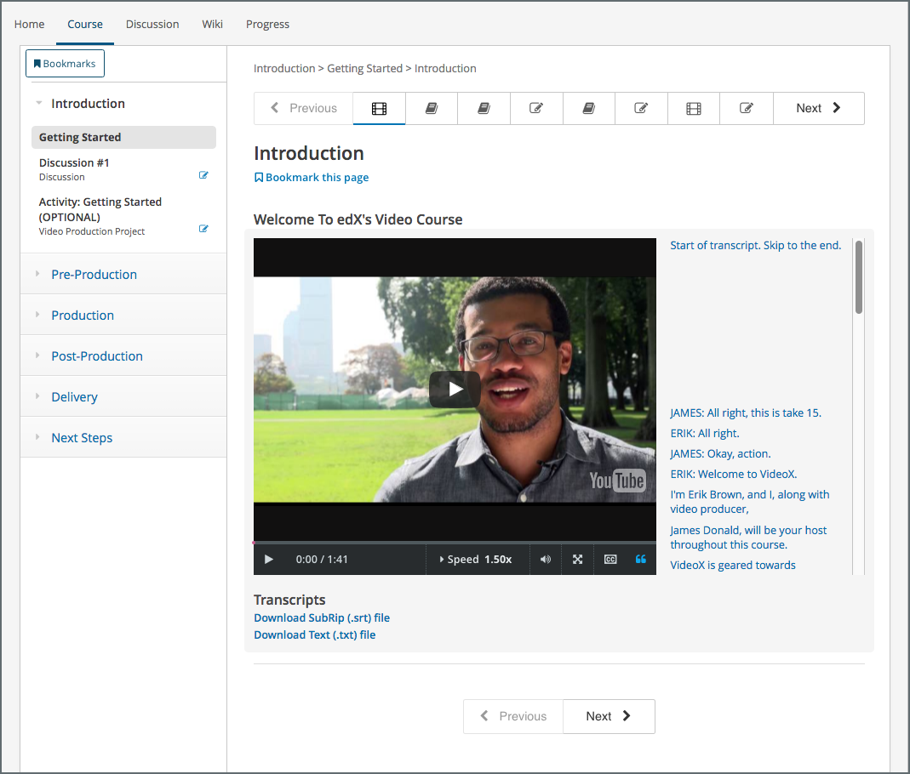

.. _XBlock Runtimes:

###############
XBlock Runtimes
###############

An XBlock runtime is the application that hosts XBlock. For example, the XBlock
SDK, the :ref:`Open edX LMS <Open edX Learning Management System as an XBlock Runtime>`,
and :ref:`Open edX Studio <Open edX Studio as an XBlock Runtime>` are all XBlock runtime
applications. You can also render an individual XBlock in HTML with the XBlock
URL.

.. contents::
 :local:
 :depth: 1

*****************
Runtime Functions
*****************

An XBlock runtime application performs the following functions.

* Instantiate XBlocks with the correct data access.

* Display the HTML returned by XBlock views.

  .. note::
    Runtime applications document the view names they require of XBlocks.

* Bind the front-end JavaScript code to the correct DOM elements.

* Route handler requests from the client-side XBlock to the server-side
  handlers.

*****************
Extending XBlocks
*****************

A runtime application can have mixin classes that it combines with your XBlock
class. Therefore, your instances of your XBlock might be subclasses of your
original XBlock class.

By using mixins, a runtime application can add field data and methods to all
XBlocks that it hosts, without requiring that XBlocks themselves are aware of
the runtime they are being hosted in.

*******************
JavaScript Runtimes
*******************

The application that runs XBlocks uses a JavaScript runtime to load XBlocks.
Specifically, the JavaScript runtime provides the following functions to
XBlocks.

* The Runtime Handler

* XBlock Children

* A map of the XBlock children

=================================
The XBlock SDK JavaScript Runtime
=================================

The file `1.js`_ in the XBlock SDK provides the JavaScript runtime for the
workbench.

.. include:: ../reusable/code_javascript_runtime.rst

==============================
The JavaScript Runtime Handler
==============================

The JavaScript runtime initializes the XBlock each time it is loaded by a user
and returns the handler so the XBlock can communicate with the server.

From the example above, the following part of the runtime generates and returns
the handler to the XBlock.

.. code-block:: javascript

    var versions = {
      1: {
        handlerUrl: function(block, handlerName, suffix, query) {
          suffix = typeof suffix !== 'undefined' ? suffix : '';
          query = typeof query !== 'undefined' ? query : '';
          var usage = $(block).data('usage');
          var url_selector = $(block).data('url_selector');
          if (url_selector !== undefined) {
            baseUrl = window[url_selector];
          }
          else {baseUrl = handlerBaseUrl;}

          // studentId and handlerBaseUrl are both defined in block.html
          return (baseUrl + usage +
                           "/" + handlerName +
                           "/" + suffix +
                   "?student=" + studentId +
                           "&" + query);
        . . .

The runtime handler code is called by the XBlock’s JavaScript code to get the
XBlock URL.

For example, the `Thumbs XBlock`_ in the XBlock SDK, the `thumbs.js`_ file gets
the handler from the XBlock runtime.

.. code-block:: javascript

    var handlerUrl = runtime.handlerUrl(element, 'vote');

===============
XBlock Children
===============

The JavaScript runtime also returns the list of child XBlocks to the XBlock.

From the example above, the following part of the runtime returns the list of
children to the XBlock.

.. code-block:: javascript

    . . .

    children: function(block) {
      return $(block).prop('xblock_children');
    },
    . . .

An XBlock uses the ``children`` method when it needs to iterate over an ordered
list of its child XBlocks.

================
XBlock Child Map
================

The JavaScript runtime also returns the a map of child XBlocks to the running
XBlock.

From the example above, the following part of the runtime generates and returns
the list of children to the XBlock.

.. code-block:: javascript

    . . .

    childMap: function(block, childName) {
        var children = this.children(block);
        for (var i = 0; i < children.length; i++) {
            var child = children[i];
            if (child.name == childName) {
                return child
            }
        }
    }
    . . .

An XBlock uses the ``childMap`` function when it needs to access different
child XBlocks to perform different actions on them.

For example, the `Problem XBlock`_ in the XBlock SDK loads JavaScript code that
gets the map of child XBlocks.

.. code-block:: javascript

    function handleCheckResults(results) {
    $.each(results.submitResults || {}, function(input, result) {
         callIfExists(runtime.childMap(element, input), 'handleSubmit', result);
     });
    $.each(results.checkResults || {}, function(checker, result) {
        callIfExists(runtime.childMap(element, checker), 'handleCheck', result);

******************
XBlock Runtime API
******************

For more information, see `XBlock Runtime API`_ in the *XBlock API Guide*.

**************************************
Rendering XBlocks with the XBlock URL
**************************************

The XBlock URL supports HTML rendering of an individual XBlock without the user
interface of the LMS.

To use the XBlock URL and return the HTML rendering of an individual XBlock,
you use the following URL path for an XBlock on an edX site.

``https://{host}/xblock/{usage_id}``

========================
Finding the ``usage_id``
========================

The ``usage_id`` is the unique identifier for the problem, video, text, or
other course content component, or for sequential or vertical course container
component. There are several ways to find the ``usage_id`` for an XBlock in the
LMS, including viewing either the staff debug info or the page source. For more
information, see
`Finding the Usage ID for Course Content`_.

===================
Example XBlock URLs
===================

For example, a video component in the "Creating Video for the edX Platform"
course on the edx.org site has the following URL.

``https://courses.edx.org/courses/course-v1:edX+VideoX+1T2016/courseware/ccc7c32c65d342618ac76409254ac238/1a52e689bcec4a9eb9b7da0bf16f682d/``

This video component appears as follows in the LMS.

        navigational options to reach all other course content.

To construct the XBlock URL for the same video component, you obtain its
``usage_id`` and then use the following URL format.

``https://courses.edx.org/xblock/block-v1:edX+VideoX+1T2016+type@video+block@47faf3a03c4f4023b187528c25932e0a``

When you use this URL, the video component appears in your browser as follows.

        course content.

For courses created prior to October 2014, the ``usage_id`` begins with
``i4x://``, as in the following example.

``https://courses.edx.org/xblock/i4x://edX/DemoX.1/problem/47bf6dbce8374b789e3ebdefd74db332``

.. _XBlock Runtime API: https://docs.openedx.org/projects/xblock/en/latest/
.. include:: ../../links.rst
