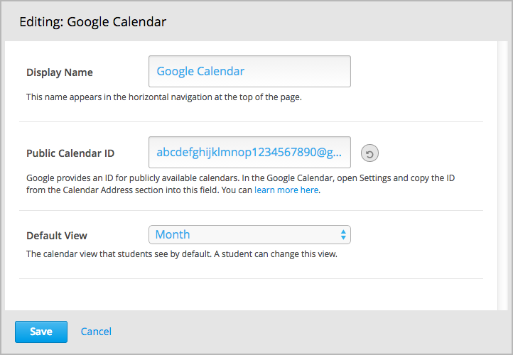
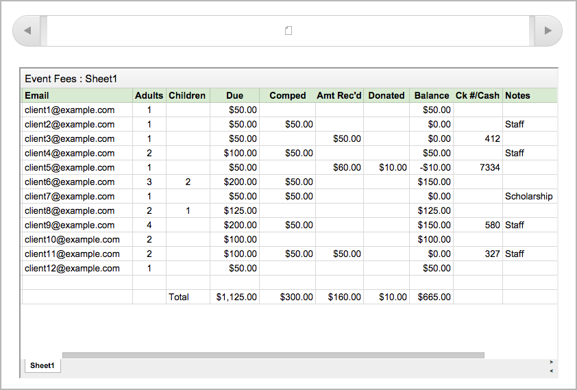

.. _XBlock Examples:

#############################
XBlock Examples
#############################

This section shows example XBlocks. These examples are meant to demonstrate
simple XBlocks and are not meant to show the range of capabilities.

.. contents::
 :local:
 :depth: 1

*********************************
Google Drive and Calendar XBlock
*********************************

Course teams can use the `Google Drive and Calendar XBlock`_ to embed Google
documents and calendars in their courseware.

The Google Drive and Calendar XBlock is created and stored in a separate GitHub
repository. You can explore the contents of this XBlock repository to learn how
it is structured and developed.

Instructions are provided so that you can install the XBlock on your Open
edX system. For more information, see :ref:`XBlocks and the edX Platform`.

================================
Adding the XBlock to Courseware
================================

When the Google Drive and Calendar XBlock is installed on the edX Platform,
course teams can add Google documents and calendars to courseware.

For example, in Studio, course teams can add and configure a Google calendar
component.

Course teams or developers can also add a Google calendar using OLX (open learning XML).

.. code-block:: xml

  <google-calendar
    url_name="4115e717366045eaae7764b2e1f25e4c"
    calendar_id="abcdefghijklmnop1234567890@group.calendar.google.com"
    default_view="1"
    display_name="Class Schedule"
  />

For more information, see `Google calendar tool`_ and
`Google Drive file tool`_ in *Building and Running an Open
edX Course*.

==================
Viewing the XBlock
==================

When course teams use the Google Drive and Calendar XBlock, learners can view
the referenced Google documents and calendars directly in their the courseware.

*********************************
Examples in the XBlock SDK
*********************************

The `XBlock SDK`_ that you use in this tutorial also contains several example
XBlocks.

We will use the `Thumbs XBlock`_ in the sections :ref:`Customize Your XBlock`
and :ref:`Anatomy of an XBlock`.

You can explore the other example XBlocks in the XBlock SDK.

* `View Counter XBlock`_
* `Problem XBlock`_
* `Slider XBlock`_
* Several `Content XBlocks`_
* Several `Structure XBlocks`_

.. include:: ../../links.rst
