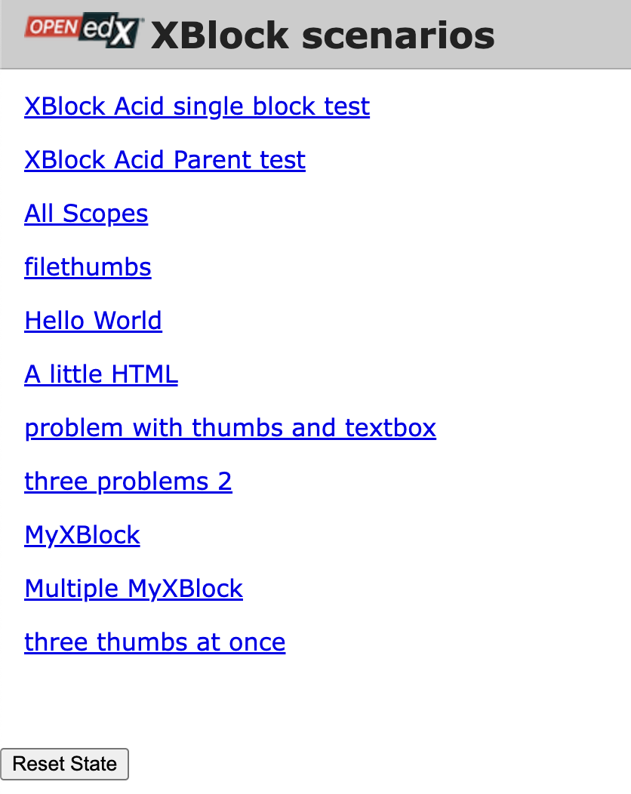

**************************
Run the XBlock SDK Server
**************************

To see the web interface of the XBlock SDK, you must run the SDK server.

In the ``xblock_development`` directory, run the following command to start the
server.

   .. code-block:: none

      (venv) $ python xblock-sdk/manage.py runserver

.. note:: If you do not specify a port, the XBlock SDK server uses port 8000.
  To use a different port, specify it in the ``runserver`` command.

Then test that the XBlock SDK is running. In a browser, go to
``http://localhost:8000``.  You should see the following page.

The page shows the XBlocks installed automatically with the XBlock SDK. Note
that the page also shows the **MyXBlock** XBlock that you created in
:ref:`Create Your First XBlock`.

====================================
Get Help for the XBlock SDK Server
====================================

To get help for the XBlock SDK ``runserver`` command, run the following
command.

   .. code-block:: none

      (venv) $ python xblock-sdk/manage.py help

The command window lists and describes the available commands.
