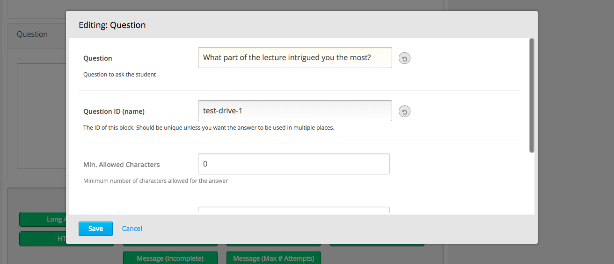

.. _XBlock Utils:

Xblock.utils
############

Package having various utilities for XBlocks
********************************************

Purpose
=======

``xblock/utils`` package contains a collection of utility functions and base test classes that are useful for any XBlock.

Documentation
=============

StudioEditableXBlockMixin
-------------------------

.. code:: python

    from xblock.utils.studio_editable import StudioEditableXBlockMixin

This mixin will automatically generate a working ``studio_view`` form
that allows content authors to edit the fields of your XBlock. To use,
simply add the class to your base class list, and add a new class field
called ``editable_fields``, set to a tuple of the names of the fields
you want your user to be able to edit.

.. code:: python

    @XBlock.needs("i18n")
    class ExampleBlock(StudioEditableXBlockMixin, XBlock):
        ...
        mode = String(
            display_name="Mode",
            help="Determines the behaviour of this component. Standard is recommended.",
            default='standard',
            scope=Scope.content,
            values=('standard', 'crazy')
        )
        editable_fields = ('mode', 'display_name')

That's all you need to do. The mixin will read the optional
``display_name``, ``help``, ``default``, and ``values`` settings from
the fields you mention and build the editor form as well as an AJAX save
handler.

If you want to validate the data, you can override
``validate_field_data(self, validation, data)`` and/or
``clean_studio_edits(self, data)`` - see the source code for details.

Supported field types:

* Boolean:
  ``field_name = Boolean(display_name="Field Name")``
* Float:
  ``field_name = Float(display_name="Field Name")``
* Integer:
  ``field_name = Integer(display_name="Field Name")``
* String:
  ``field_name = String(display_name="Field Name")``
* String (multiline):
  ``field_name = String(multiline_editor=True, resettable_editor=False)``
* String (html):
  ``field_name = String(multiline_editor='html', resettable_editor=False)``

Any of the above will use a dropdown menu if they have a pre-defined
list of possible values.

* List of unordered unique values (i.e. sets) drawn from a small set of
  possible values:
  ``field_name = List(list_style='set', list_values_provider=some_method)``

  - The ``List`` declaration must include the property ``list_style='set'`` to
    indicate that the ``List`` field is being used with set semantics.
  - The ``List`` declaration must also define a ``list_values_provider`` method
    which will be called with the block as its only parameter and which must
    return a list of possible values.
* Rudimentary support for Dict, ordered List, and any other JSONField-derived field types

  - ``list_field = List(display_name="Ordered List", default=[])``
  - ``dict_field = Dict(display_name="Normal Dict", default={})``

Supported field options (all field types):

* ``values`` can define a list of possible options, changing the UI element
  to a select box. Values can be set to any of the formats `defined in the
  XBlock source code <https://github.com/openedx/XBlock/blob/master/xblock/fields.py>`__:

  - A finite set of elements: ``[1, 2, 3]``
  - A finite set of elements where the display names differ from the values::

        [
            {"display_name": "Always", "value": "always"},
            {"display_name": "Past Due", "value": "past_due"},
        ]

  - A range for floating point numbers with specific increments:
    ``{"min": 0 , "max": 10, "step": .1}``
  - A callable that returns one of the above. (Note: the callable does
    *not* get passed the XBlock instance or runtime, so it cannot be a
    normal member function)
* ``values_provider`` can define a callable that accepts the XBlock
  instance as an argument, and returns a list of possible values in one
  of the formats listed above.
* ``resettable_editor`` - defaults to ``True``. Set ``False`` to hide the
  "Reset" button used to return a field to its default value by removing
  the field's value from the XBlock instance.

Basic screenshot: |Screenshot 1|

StudioContainerXBlockMixin
--------------------------

.. code:: python

    from xblock.utils.studio_editable import StudioContainerXBlockMixin

This mixin helps to create XBlocks that allow content authors to add,
remove, or reorder child blocks. By removing any existing
``author_view`` and adding this mixin, you'll get editable,
re-orderable, and deletable child support in Studio. To enable authors to
add arbitrary blocks as children, simply override ``author_edit_view``
and set ``can_add=True`` when calling ``render_children`` - see the
source code. To restrict authors so they can add only specific types of
child blocks or a limited number of children requires custom HTML.

An example is the mentoring XBlock: |Screenshot 2|

child\_isinstance
-------------------------

.. code:: python

    from xblock.utils.helpers import child_isinstance

If your XBlock needs to find children/descendants of a particular
class/mixin, you should use

.. code:: python

    child_isinstance(self, child_usage_id, SomeXBlockClassOrMixin)

rather than calling

.. code:: python

    isinstance(self.runtime.get_block(child_usage_id), SomeXBlockClassOrMixin)

On runtimes such as those in edx-platform, ``child_isinstance`` is
orders of magnitude faster.

XBlockWithSettingsMixin
-------------------------

This mixin provides access to instance-wide XBlock-specific configuration settings.
See :ref:`accessing-xblock-specific-settings` for details.

ThemableXBlockMixin
-------------------------

This mixin provides XBlock theming capabilities built on top of XBlock-specific settings.
See :ref:`theming-support` for details.

To learn more, refer to the  page.

.. toctree::
    :caption: Contents:

    settings-and-theme-support
